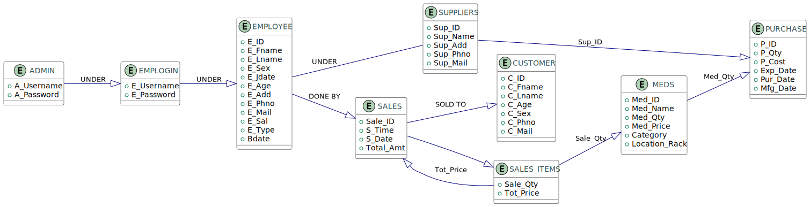

# Phamacy System

The project aims to assist a pharmacy in managing its inventory, details of customers, employees and suppliers as well
as keeping track of its purchases and sales.

## Endpoints

### Medicine Management

- Function: Access and update the list of medicines.
- API Endpoints:
    - GET `/medicines`: Retrieve all available medicines (Admins: full details, Pharmacists: read-only).
    - POST `/medicines`: Add a new medicine (Admin only).
    - PUT `/medicines/{id}`: Update medicine details (Admin only).
    - DELETE `/medicines/{id}`: Remove a medicine (Admin only).

### Supplier Management

- Function: Manage suppliers.
- API Endpoints:
    - GET `/suppliers`: Get the list of suppliers (Admin only).
    - POST `/suppliers`: Add a new supplier (Admin only).
    - PUT `/suppliers/{id}`: Update supplier details (Admin only).
    - DELETE `/suppliers/{id}`: Remove a supplier (Admin only).

### Stock Purchase Management

- Function: Manage stock purchases.
- API Endpoints:
    - GET `/purchases`: View all stock purchase records (Admin only).
    - POST `/purchases`: Add a new stock purchase record (Admin only).
    - PUT `/purchases/{id}`: Update purchase details (Admin only).
    - DELETE `/purchases/{id}`: Delete a stock purchase record (Admin only).

### Employee Management

- Function: Manage employees.
- API Endpoints:
    - GET `/employees`: Get the list of employees (Admin only).
    - POST `/employees`: Add a new employee (Admin only).
    - PUT `/employees/{id}`: Update employee details (Admin only).
    - DELETE `/employees/{id}`: Remove an employee (Admin only).

### Customer Management

- Function: Manage customers.
- API Endpoints:
    - GET `/customers`: Get the list of customers (Admins: full details, Pharmacists: minimal details).
    - POST `/customers`: Add a new customer (Admins and Pharmacists).
    - PUT `/customers/{id}`: Update customer details (Admin only).
    - DELETE `/customers/{id}`: Remove a customer (Admin only).

### Sales Transaction Management

- Function: Manage sales transactions.
- API Endpoints:
    - GET `/sales`: Get all sales transactions (Admin: all transactions, Pharmacists: own transactions).
    - POST `/sales`: Register a new sale (Pharmacists).

### Reports

- Function: Generate reports.
- API Endpoints:
    - GET `/reports/sales`: Generate sales report (Admin only).
    - GET `/reports/inventory`: Generate inventory report (Admin only).
    - GET `/reports/customers`: Generate customer report (Admin only).

## ER Diagram



## RDM Diagram


## Database Schema Description

| Table Name      | Field Name      | Data Type        | Constraints                                     | Description                                                |
|-----------------|-----------------|------------------|-------------------------------------------------|------------------------------------------------------------|
| **EMPLOYEE**    | `E_ID`          | `VARCHAR(36)`    | Primary Key (PK)                                | Unique identifier for each employee.                       |
|                 | `E_Username`    | `VARCHAR(50)`    | NOT NULL, UNIQUE                                | Employee's username.                                       |
|                 | `E_Fname`       | `VARCHAR(255)`   | NOT NULL                                        | Employee's first name.                                     |
|                 | `E_Lname`       | `VARCHAR(255)`   | NOT NULL                                        | Employee's last name.                                      |
|                 | `E_Bdate`       | `DATE`           |                                                 | Employee's birth date.                                     |
|                 | `E_Age`         | `INT`            |                                                 | Employee's age.                                            |
|                 | `E_Sex`         | `CHAR(1)`        | NOT NULL                                        | Employee's gender (M/F).                                   |
|                 | `E_Type`        | `VARCHAR(50)`    | NOT NULL                                        | Employee's type/role (e.g., manager, cashier).             |
|                 | `E_Jdate`       | `DATE`           | NOT NULL                                        | Employee's joining date.                                   |
|                 | `E_Add`         | `VARCHAR(255)`   |                                                 | Employee's address.                                        |
|                 | `E_Mail`        | `VARCHAR(255)`   |                                                 | Employee's email address.                                  |
|                 | `E_Phno`        | `VARCHAR(20)`    |                                                 | Employee's phone number.                                   |
|                 | `E_Sal`         | `DECIMAL(10, 2)` |                                                 | Employee's salary.                                         |
|                 | `created_date`  | `DATE`           |                                                 |                                                            |
|                 | `created_by`    | `VARCHAR(36)`    |                                                 |                                                            |
|                 | `updated_date`  | `DATE`           |                                                 |                                                            |
|                 | `updated_by`    | `VARCHAR(36)`    |                                                 |                                                            |
| **SUPPLIERS**   | `Sup_ID`        | `VARCHAR(36)`    | Primary Key (PK)                                | Unique identifier for each supplier.                       |
|                 | `Sup_Name`      | `VARCHAR(255)`   | NOT NULL                                        | Name of the supplier.                                      |
|                 | `Sup_Add`       | `VARCHAR(255)`   | NOT NULL                                        | Supplier's address.                                        |
|                 | `Sup_Phno`      | `VARCHAR(20)`    | NOT NULL                                        | Supplier's phone number.                                   |
|                 | `Sup_Mail`      | `VARCHAR(255)`   |                                                 | Supplier's email address.                                  |
|                 | `created_date`  | `DATE`           |                                                 |                                                            |
|                 | `created_by`    | `VARCHAR(36)`    |                                                 |                                                            |
|                 | `updated_date`  | `DATE`           |                                                 |                                                            |
|                 | `updated_by`    | `VARCHAR(36)`    |                                                 |                                                            |
| **CUSTOMER**    | `C_ID`          | `VARCHAR(36)`    | Primary Key (PK)                                | Unique identifier for each customer.                       |
|                 | `C_Fname`       | `VARCHAR(255)`   | NOT NULL                                        | Customer's first name.                                     |
|                 | `C_Lname`       | `VARCHAR(255)`   | NOT NULL                                        | Customer's last name.                                      |
|                 | `C_Age`         | `INT`            | NOT NULL                                        | Customer's age.                                            |
|                 | `C_Sex`         | `CHAR(1)`        | NOT NULL                                        | Customer's gender (M/F).                                   |
|                 | `C_Phno`        | `VARCHAR(20)`    | NOT NULL                                        | Customer's phone number.                                   |
|                 | `C_Mail`        | `VARCHAR(255)`   |                                                 | Customer's email address.                                  |
|                 | `created_date`  | `DATE`           |                                                 |                                                            |
|                 | `created_by`    | `VARCHAR(36)`    |                                                 |                                                            |
|                 | `updated_date`  | `DATE`           |                                                 |                                                            |
|                 | `updated_by`    | `VARCHAR(36)`    |                                                 |                                                            |
| **MEDS**        | `Med_ID`        | `VARCHAR(50)`    | Primary Key (PK)                                | Unique identifier for each medicine.                       |
|                 | `Med_Name`      | `VARCHAR(255)`   | NOT NULL                                        | Name of the medicine.                                      |
|                 | `Med_Qty`       | `INT`            | NOT NULL                                        | Quantity of the medicine available in stock.               |
|                 | `Med_Price`     | `DECIMAL(10, 2)` | NOT NULL                                        | Price of the medicine.                                     |
|                 | `Category`      | `VARCHAR(255)`   | NOT NULL                                        | Medicine category (e.g., painkiller, antibiotic).          |
|                 | `Location_Rack` | `VARCHAR(50)`    | NOT NULL                                        | Rack location of the medicine in the store.                |
|                 | `created_date`  | `DATE`           |                                                 |                                                            |
|                 | `created_by`    | `VARCHAR(36)`    |                                                 |                                                            |
|                 | `updated_date`  | `DATE`           |                                                 |                                                            |
|                 | `updated_by`    | `VARCHAR(36)`    |                                                 |                                                            |
| **PURCHASE**    | `P_ID`          | `VARCHAR(36)`    | Primary Key (PK)                                | Unique identifier for each purchase transaction.           |
|                 | `Med_ID`        | `VARCHAR(36)`    | Foreign Key (FK) references `MEDS(Med_ID)`      | The medicine purchased in this transaction.                |
|                 | `Sup_ID`        | `VARCHAR(36)`    | Foreign Key (FK) references `SUPPLIERS(Sup_ID)` | The supplier involved in the purchase.                     |
|                 | `P_Qty`         | `INT`            | NOT NULL                                        | Quantity of medicine purchased.                            |
|                 | `P_Cost`        | `DECIMAL(10, 2)` | NOT NULL                                        | Total cost of the purchase.                                |
|                 | `Pur_Date`      | `DATE`           | NOT NULL                                        | Date the purchase was made.                                |
|                 | `Mfg_Date`      | `DATE`           | NOT NULL                                        | Manufacturing date of the medicine.                        |
|                 | `Exp_Date`      | `DATE`           | NOT NULL                                        | Expiration date of the medicine.                           |
|                 | `created_date`  | `DATE`           |                                                 |                                                            |
|                 | `created_by`    | `VARCHAR(36)`    |                                                 |                                                            |
|                 | `updated_date`  | `DATE`           |                                                 |                                                            |
|                 | `updated_by`    | `VARCHAR(36)`    |                                                 |                                                            |
| **SALES**       | `Sale_ID`       | `VARCHAR(36)`    | Primary Key (PK)                                | Unique identifier for each sales transaction.              |
|                 | `S_Date`        | `DATE`           | NOT NULL                                        | Date of the sale.                                          |
|                 | `S_Time`        | `TIME`           | NOT NULL                                        | Time of the sale.                                          |
|                 | `Total_Amt`     | `DECIMAL(10, 2)` | NOT NULL                                        | Total amount of the sale.                                  |
|                 | `C_ID`          | `VARCHAR(50)`    | Foreign Key (FK) references `CUSTOMER(C_ID)`    | The customer making the purchase.                          |
|                 | `E_ID`          | `VARCHAR(50)`    | Foreign Key (FK) references `EMPLOYEE(E_ID)`    | The employee handling the sale.                            |
|                 | `created_date`  | `DATE`           |                                                 |                                                            |
|                 | `created_by`    | `VARCHAR(36)`    |                                                 |                                                            |
|                 | `updated_date`  | `DATE`           |                                                 |                                                            |
|                 | `updated_by`    | `VARCHAR(36)`    |                                                 |                                                            |
| **SALES_ITEMS** | `Med_ID`        | `VARCHAR(36)`    | Foreign Key (FK) references `MEDS(Med_ID)`      | The medicine sold in this transaction.                     |
|                 | `Sale_ID`       | `VARCHAR(36)`    | Foreign Key (FK) references `SALES(Sale_ID)`    | The sale to which the medicine belongs.                    |
|                 | `Sale_Qty`      | `INT`            | NOT NULL                                        | Quantity of the medicine sold.                             |
|                 | `Tot_Price`     | `DECIMAL(10, 2)` | NOT NULL                                        | Total price for the sold quantity.                         |
|                 | [PK]            | Composite Key    | (`Med_ID`, `Sale_ID`)                           | Composite primary key consisting of medicine and sale IDs. |
|                 | `created_date`  | `DATE`           |                                                 |                                                            |
|                 | `created_by`    | `VARCHAR(36)`    |                                                 |                                                            |
|                 | `updated_date`  | `DATE`           |                                                 |                                                            |
|                 | `updated_by`    | `VARCHAR(36)`    |                                                 |                                                            |

# How to Run
```shell
./gradlew build
```

```shell
docker compose up
```

```shell
./gradlew bootRun
```

# How to test (postman collection)

[postman collection here!](src/test/postman/pharmacy.postman_collection.json)