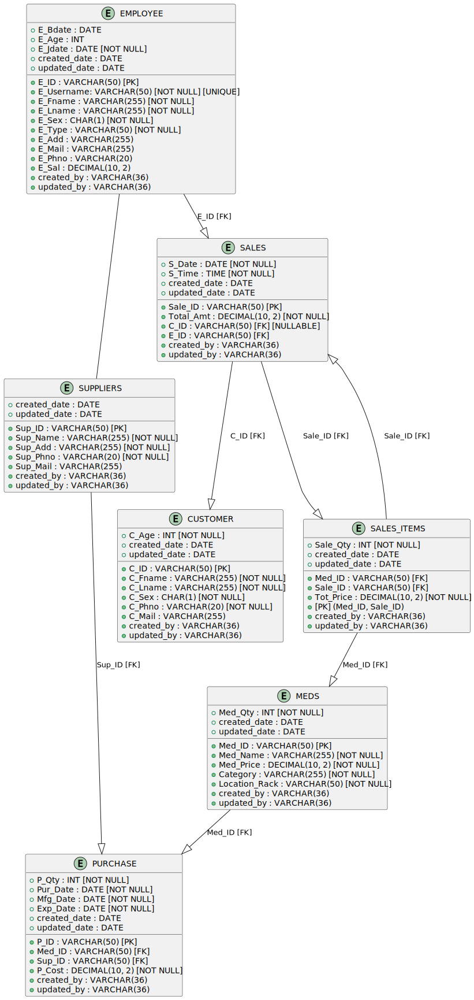
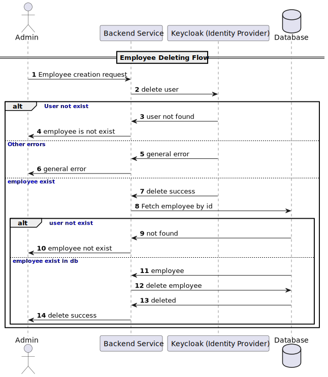
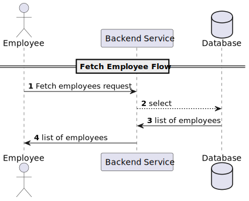
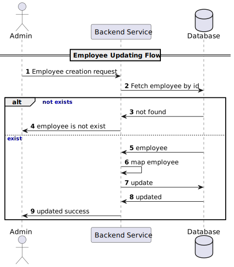

# Pharmacy System

The project aims to assist a pharmacy in managing its inventory, details of customers, employees and suppliers as well
as keeping track of its purchases and sales.

## Endpoints

prefix: `/pharmacy/api/v1`

### Medicine Management

- Function: Access and update the list of medicines.
- API Endpoints:
    - GET `/medicines`: Retrieve all available medicines (Admins: full details, Pharmacists: read-only).
    - POST `/medicines`: Add a new medicine (Admin only).
    - PUT `/medicines/{id}`: Update medicine details (Admin only).
    - DELETE `/medicines/{id}`: Remove a medicine (Admin only).

### Location track Management

- Function: Access and update the list of location track.
- API Endpoints:
    - GET `/locationRacks`: Retrieve all available location tracks (Admins, Pharmacists).
    - POST `/locationRacks`: Add a new location track (Admin only).
    - PUT `/locationRacks/{id}`: Update location track details (Admin only).
    - DELETE `/locationRacks/{id}`: Remove a location track (Admin only).

### Medicine category Management

- Function: Access and update the list of medicine category.
- API Endpoints:
  - GET `/medicineCategories`: Retrieve all available medicine categories (Admins, Pharmacists).
  - POST `/medicineCategories`: Add a new medicine category (Admin only).
  - PUT `/medicineCategories/{id}`: Update medicine category details (Admin only).
  - DELETE `/medicineCategories/{id}`: Remove a medicine category (Admin only).


### Supplier Management

- Function: Manage suppliers.
- API Endpoints:
    - GET `/suppliers`: Get the list of suppliers (Admin only).
    - POST `/suppliers`: Add a new supplier (Admin only).
    - PUT `/suppliers/{id}`: Update supplier details (Admin only).
    - DELETE `/suppliers/{id}`: Remove a supplier (Admin only).

### Stock Purchase Management

- Function: Manage stock purchases.
- API Endpoints:
    - GET `/purchases`: View all stock purchase records (Admin only).
    - POST `/purchases`: Add a new stock purchase record (Admin only).
    - PUT `/purchases/{id}`: Update purchase details (Admin only).
    - DELETE `/purchases/{id}`: Delete a stock purchase record (Admin only).

### Employee Management

- Function: Manage employees.
- API Endpoints:
    - GET `/employees`: Get the list of employees (Admin only).
    - POST `/employees`: Add a new employee (Admin only).
    - PUT `/employees/{id}`: Update employee details (Admin only).
    - DELETE `/employees/{id}`: Remove an employee (Admin only).
    - POST `/employees/changePassword`: Change password (Admin, Pharmacist)

### Customer Management

- Function: Manage customers.
- API Endpoints:
    - GET `/customers`: Get the list of customers (Admins: full details, Pharmacists: minimal details).
    - POST `/customers`: Add a new customer (Admins and Pharmacists).
    - PUT `/customers/{id}`: Update customer details (Admin only).
    - DELETE `/customers/{id}`: Remove a customer (Admin only).

### Sales Transaction Management

- Function: Manage sales transactions.
- API Endpoints:
    - POST `/sales`: Register a new sale (Admin, Pharmacists).

### Reports

- Function: Generate reports.
- API Endpoints:
    - GET `/reports/sales`: Generate sales report (Admin: all transactions, Pharmacists: own transactions).
    - GET `/reports/inventory`: Generate inventory report (Admin only).

### Customer points config

- Function: Access and update customer points configuration
- API Endpoints:
  - GET `/customerPointConfigs`: Get customer points configuration (Admin).
  - PUT `/customerPointConfigs/{id}`: Update customer points configuration (Admin).

## RDM Diagram



## Database Schema Description

| Table Name       | Column Name          | Data Type             | Constraints                                      | Description                                     |
|------------------|----------------------|-----------------------|--------------------------------------------------|-------------------------------------------------|
| EMPLOYEE         | E_ID                 | VARCHAR(36)           | PRIMARY KEY                                      | Employee ID (UUID)                              |
|                  | E_Username           | VARCHAR(50)           | NOT NULL, UNIQUE                                 | Username                                        |
|                  | E_Fname              | VARCHAR(255)          | NOT NULL                                         | First name                                      |
|                  | E_Lname              | VARCHAR(255)          | NOT NULL                                         | Last name                                       |
|                  | E_Bdate              | DATE                  |                                                  | Birth date                                      |
|                  | E_Age                | INT                   |                                                  | Age                                             |
|                  | E_Sex                | CHAR(1)               | NOT NULL                                         | Sex (M/F)                                       |
|                  | E_Type               | VARCHAR(50)           | NOT NULL                                         | Employee type (e.g., Pharmacist, Admin)         |
|                  | E_Jdate              | DATE                  | NOT NULL                                         | Joining date                                    |
|                  | E_Add                | VARCHAR(255)          |                                                  | Address                                         |
|                  | E_Mail               | VARCHAR(255)          |                                                  | Email address                                   |
|                  | E_Phno               | VARCHAR(20)           | NOT NULL                                         | Phone number                                    |
|                  | E_Sal                | DECIMAL(10, 2)        |                                                  | Salary                                          |
|                  | created_date         | TIMESTAMP             | NOT NULL                                         | Creation date                                   |
|                  | created_by           | VARCHAR(36)           | NOT NULL                                         | Created by (User ID)                            |
|                  | updated_date         | TIMESTAMP             |                                                  | Last update date                                |
|                  | updated_by           | VARCHAR(36)           |                                                  | Updated by (User ID)                            |
| ---------------- | ------------------   | --------------------- | ------------------------------------------------ | ----------------------------------------------- |
| SUPPLIER         | Sup_ID               | VARCHAR(36)           | PRIMARY KEY                                      | Supplier ID (UUID)                              |
|                  | Sup_Name             | VARCHAR(255)          | NOT NULL                                         | Supplier name                                   |
|                  | Sup_Add              | VARCHAR(255)          | NOT NULL                                         | Supplier address                                |
|                  | Sup_Phno             | VARCHAR(20)           | NOT NULL                                         | Supplier phone number                           |
|                  | Sup_Mail             | VARCHAR(255)          |                                                  | Supplier email address                          |
|                  | created_date         | TIMESTAMP             | NOT NULL                                         | Creation date                                   |
|                  | created_by           | VARCHAR(36)           | NOT NULL                                         | Created by (User ID)                            |
|                  | updated_date         | TIMESTAMP             |                                                  | Last update date                                |
|                  | updated_by           | VARCHAR(36)           |                                                  | Updated by (User ID)                            |
| ---------------- | ------------------   | --------------------- | ------------------------------------------------ | ----------------------------------------------- |
| CUSTOMER         | C_ID                 | VARCHAR(36)           | NOT NULL                                         | Customer ID (UUID)                              |
|                  | C_Fname              | VARCHAR(255)          | NOT NULL                                         | Customer first name                             |
|                  | C_Lname              | VARCHAR(255)          | NOT NULL                                         | Customer last name                              |
|                  | C_Age                | INT                   |                                                  | Customer age                                    |
|                  | C_Sex                | CHAR(1)               | NOT NULL                                         | Customer sex                                    |
|                  | C_Phno               | VARCHAR(20)           | NOT NULL                                         | Customer phone number                           |
|                  | C_Mail               | VARCHAR(255)          |                                                  | Customer email address                          |
|                  | C_Point_accumulation | INT                   |                                                  | Customer accumulated points                     |
|                  | created_date         | TIMESTAMP             | NOT NULL, UNIQUE                                 | Customer creation date                          |
|                  | created_by           | VARCHAR(36)           | NOT NULL                                         | Created by (User ID)                            |
|                  | updated_date         | TIMESTAMP             |                                                  | Last update date                                |
|                  | updated_by           | VARCHAR(36)           |                                                  | Updated by (User ID)                            |
| ---------------- | ------------------   | --------------------- | ------------------------------------------------ | ----------------------------------------------- |
| MED_CATEGORY     | Cat_ID               | VARCHAR(36)           | PRIMARY KEY                                      | Medicine category ID (UUID)                     |
|                  | Cat_Name             | VARCHAR(255)          | NOT NULL                                         | Category name                                   |
|                  | Cat_Description      | VARCHAR(1000)         |                                                  | Category description                            |
|                  | created_date         | TIMESTAMP             | NOT NULL                                         | Category creation date                          |
|                  | created_by           | VARCHAR(36)           | NOT NULL                                         | Created by (User ID)                            |
|                  | updated_date         | TIMESTAMP             |                                                  | Last update date                                |
|                  | updated_by           | VARCHAR(36)           |                                                  | Updated by (User ID)                            |
| ---------------- | ------------------   | --------------------- | ------------------------------------------------ | ----------------------------------------------- |
| MED              | Med_ID               | VARCHAR(36)           | PRIMARY KEY                                      | Medicine ID (UUID)                              |
|                  | Med_Name             | VARCHAR(255)          | NOT NULL                                         | Medicine name                                   |
|                  | Med_Price            | DECIMAL(10, 2)        | NOT NULL                                         | Medicine price                                  |
|                  | Cat_ID               | VARCHAR(36)           | NOT NULL                                         | Category ID (UUID)                              |
|                  | created_date         | TIMESTAMP             | NOT NULL                                         | Medicine creation date                          |
|                  | created_by           | VARCHAR(36)           | NOT NULL                                         | Created by (User ID)                            |
|                  | updated_date         | TIMESTAMP             |                                                  | Last update date                                |
|                  | updated_by           | VARCHAR(36)           |                                                  | Updated by (User ID)                            |
| ---------------- | ------------------   | --------------------- | ------------------------------------------------ | ----------------------------------------------- |
| PURCHASE         | P_ID                 | VARCHAR(36)           | PRIMARY KEY                                      | Purchase ID (UUID)                              |
|                  | Med_ID               | VARCHAR(36)           | NOT NULL                                         | Medicine ID (UUID)                              |
|                  | Sup_ID               | VARCHAR(36)           | NOT NULL                                         | Supplier ID (UUID)                              |
|                  | P_Qty                | INT                   | NOT NULL                                         | Purchase quantity                               |
|                  | P_Cost               | DECIMAL(10, 2)        | NOT NULL                                         | Purchase cost                                   |
|                  | created_date         | TIMESTAMP             | NOT NULL                                         | Purchase creation date                          |
|                  | created_by           | VARCHAR(36)           | NOT NULL                                         | Created by (User ID)                            |
|                  | updated_date         | TIMESTAMP             |                                                  | Last update date                                |
|                  | updated_by           | VARCHAR(36)           |                                                  | Updated by (User ID)                            |
| ---------------- | ------------------   | --------------------- | ------------------------------------------------ | ----------------------------------------------- |
| SALE             | Sale_ID              | VARCHAR(36)           | NOT NULL                                         | Sale ID (UUID)                                  |
|                  | Total_Amt            | DECIMAL(10, 2)        |                                                  | Total sale amount                               |
|                  | C_ID                 | VARCHAR(36)           |                                                  | Customer ID (UUID) (nullable for anonymous)     |
|                  | created_date         | TIMESTAMP             | NOT NULL, UNIQUE                                 | Sale creation date                              |
|                  | created_by           | VARCHAR(36)           | NOT NULL                                         | Created by (User ID)                            |
|                  | updated_date         | TIMESTAMP             |                                                  | Last update date                                |
|                  | updated_by           | VARCHAR(36)           |                                                  | Updated by (User ID)                            |
| ---------------- | ------------------   | --------------------- | ------------------------------------------------ | ----------------------------------------------- |
| SALE_ITEM        | I_ID                 | VARCHAR(36)           | PRIMARY KEY (I_ID, Sale_ID)                      | Medicine ID (UUID)                              |
|                  | Sale_ID              | VARCHAR(36)           | PRIMARY KEY (I_ID, Sale_ID)                      | Sale ID (UUID)                                  |
|                  | Sale_Qty             | INT                   | NOT NULL                                         | Quantity sold                                   |
|                  | Tot_Price            | DECIMAL(10, 2)        | NOT NULL                                         | Total price of the sale item                    |
|                  | created_date         | TIMESTAMP             | NOT NULL                                         | Sale item creation date                         |
|                  | created_by           | VARCHAR(36)           | NOT NULL                                         | Created by (User ID)                            |
|                  | updated_date         | TIMESTAMP             |                                                  | Last update date                                |
|                  | updated_by           | VARCHAR(36)           |                                                  | Updated by (User ID)                            |
| ---------------- | ------------------   | --------------------- | ------------------------------------------------ | ----------------------------------------------- |
| LOCATION_RACK    | LR_ID                | VARCHAR(36)           | PRIMARY KEY                                      | Location Rack ID (UUID)                         |
|                  | LR_POSITION          | VARCHAR(50)           | NOT NULL                                         | Rack position                                   |
|                  | created_date         | TIMESTAMP             | NOT NULL                                         | Location rack creation date                     |
|                  | created_by           | VARCHAR(36)           | NOT NULL                                         | Created by (User ID)                            |
|                  | updated_date         | TIMESTAMP             |                                                  |

## Function flow

### Employee

#### Creation



#### Fetching



#### Updating



#### Deleting


# How to Run

```shell
./gradlew build
```

```shell
docker compose up
```

```shell
./gradlew bootRun
```

The application will be running on port `8081`

# How to test (postman collection)

[postman collection here!](src/test/postman/pharmacy.postman_collection.json)