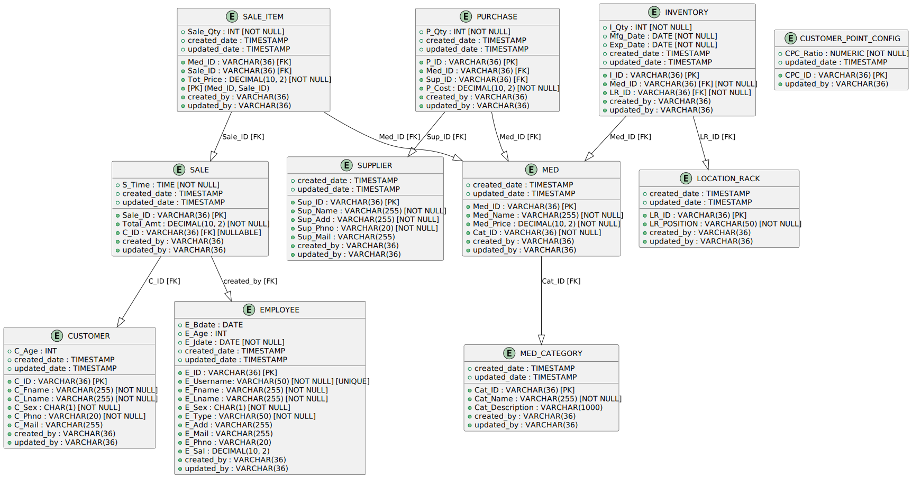

# Phamacy System
The project aims to assist a pharmacy in managing its inventory, details of customers, employees and suppliers as well as keeping track of its purchases and sales.

## Endpoints
### Medicine Management

- Function: Access and update the list of medicines.
- API Endpoints:
  - GET `/medicines`: Retrieve all available medicines (Admins: full details, Pharmacists: read-only).
  - POST `/medicines`: Add a new medicine (Admin only).
  - PUT `/medicines/{id}`: Update medicine details (Admin only).
  - DELETE `/medicines/{id}`: Remove a medicine (Admin only).
### Supplier Management
- Function: Manage suppliers.
- API Endpoints:
  - GET `/suppliers`: Get the list of suppliers (Admin only).
  - POST `/suppliers`: Add a new supplier (Admin only).
  - PUT `/suppliers/{id}`: Update supplier details (Admin only).
  - DELETE `/suppliers/{id}`: Remove a supplier (Admin only).
### Stock Purchase Management
- Function: Manage stock purchases.
- API Endpoints:
  - GET `/purchases`: View all stock purchase records (Admin only).
  - POST `/purchases`: Add a new stock purchase record (Admin only).
  - PUT `/purchases/{id}`: Update purchase details (Admin only).
  - DELETE `/purchases/{id}`: Delete a stock purchase record (Admin only).
### Employee Management
- Function: Manage employees.
- API Endpoints:
  - GET `/employees`: Get the list of employees (Admin only).
  - POST `/employees`: Add a new employee (Admin only).
  - PUT `/employees/{id}`: Update employee details (Admin only).
  - DELETE `/employees/{id}`: Remove an employee (Admin only).
### Customer Management
- Function: Manage customers.
- API Endpoints:
  - GET `/customers`: Get the list of customers (Admins: full details, Pharmacists: minimal details).
  - POST `/customers`: Add a new customer (Admins and Pharmacists).
  - PUT `/customers/{id}`: Update customer details (Admin only).
  - DELETE `/customers/{id}`: Remove a customer (Admin only).
### Sales Transaction Management
- Function: Manage sales transactions.
- API Endpoints:
  - GET `/sales`: Get all sales transactions (Admin: all transactions, Pharmacists: own transactions).
  - POST `/sales`: Register a new sale (Pharmacists).
### Reports
- Function: Generate reports.
- API Endpoints:
  - GET `/reports/sales`: Generate sales report (Admin only).
  - GET `/reports/inventory`: Generate inventory report (Admin only).
  - GET `/reports/customers`: Generate customer report (Admin only).

## ER Diagram

## RDM Diagram
