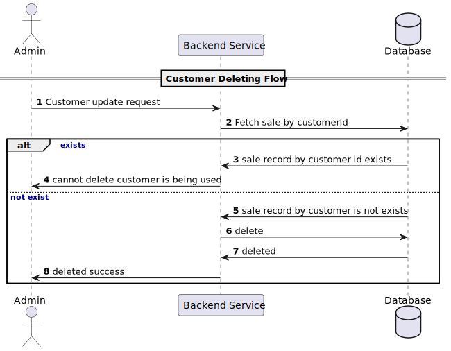
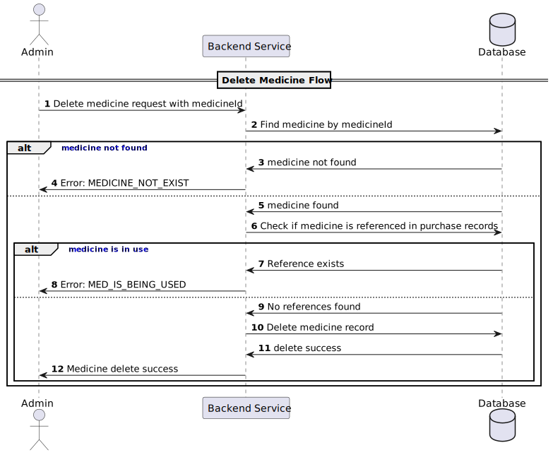
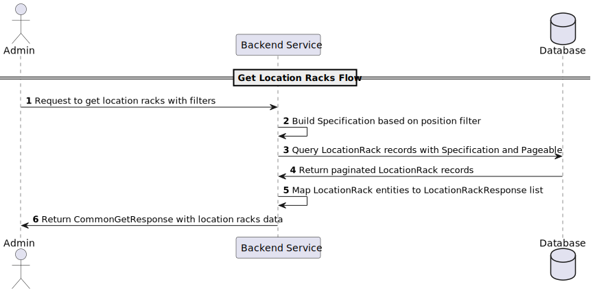
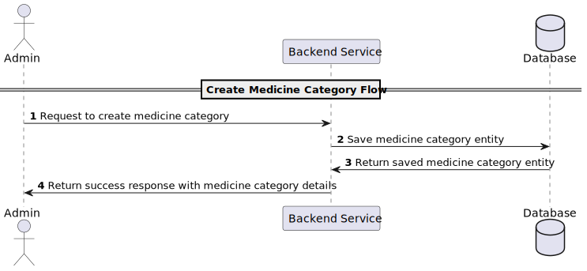
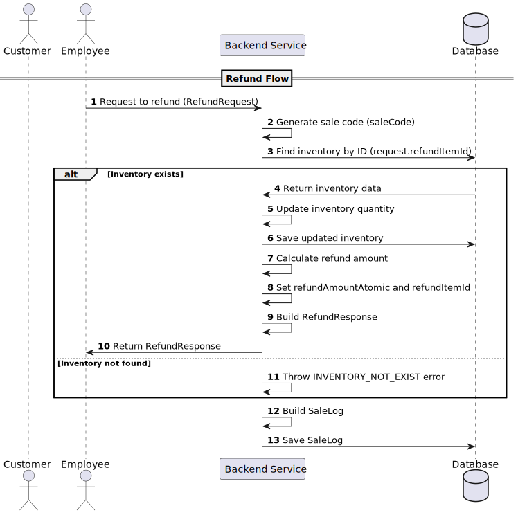
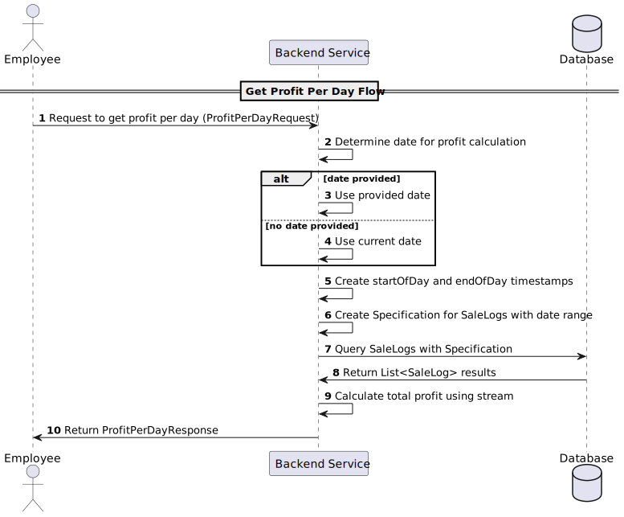

# Pharmacy System

The project aims to assist a pharmacy in managing its inventory, details of customers, employees and suppliers as well
as keeping track of its purchases and sales.

## Endpoints

prefix: `/pharmacy/api/v1`

### Medicine Management

- Function: Access and update the list of medicines.
- API Endpoints:
    - GET `/medicines`: Retrieve all available medicines (Admins: full details, User: read-only).
    - POST `/medicines`: Add a new medicine (Admin only).
    - PUT `/medicines/{id}`: Update medicine details (Admin only).
    - DELETE `/medicines/{id}`: Remove a medicine (Admin only).

### Location track Management

- Function: Access and update the list of location track.
- API Endpoints:
    - GET `/locationRacks`: Retrieve all available location tracks (Admins, User).
    - POST `/locationRacks`: Add a new location track (Admin only).
    - PUT `/locationRacks/{id}`: Update location track details (Admin only).
    - DELETE `/locationRacks/{id}`: Remove a location track (Admin only).

### Medicine category Management

- Function: Access and update the list of medicine category.
- API Endpoints:
    - GET `/medicineCategories`: Retrieve all available medicine categories (Admin only).
    - POST `/medicineCategories`: Add a new medicine category (Admin only).
    - PUT `/medicineCategories/{id}`: Update medicine category details (Admin only).
    - DELETE `/medicineCategories/{id}`: Remove a medicine category (Admin only).

### Supplier Management

- Function: Manage suppliers.
- API Endpoints:
    - GET `/suppliers`: Get the list of suppliers (Admin only).
    - POST `/suppliers`: Add a new supplier (Admin only).
    - PUT `/suppliers/{id}`: Update supplier details (Admin only).
    - DELETE `/suppliers/{id}`: Remove a supplier (Admin only).

### Stock Purchase Management

- Function: Manage stock purchases.
- API Endpoints:
    - GET `/purchases`: View all stock purchase records (Admin only).
    - POST `/purchases`: Add a new stock purchase record (Admin only).
    - PUT `/purchases/{id}`: Update purchase details (Admin only).
    - DELETE `/purchases/{id}`: Delete a stock purchase record (Admin only).

### Employee Management

- Function: Manage employees.
- API Endpoints:
    - GET `/employees`: Get the list of employees (Admin only).
    - POST `/employees`: Add a new employee (Admin only).
    - PUT `/employees/{id}`: Update employee details (Admin only).
    - DELETE `/employees/{id}`: Remove an employee (Admin only).
    - POST `/employees/changePassword`: Change password (Admin, Pharmacist)

### Customer Management

- Function: Manage customers.
- API Endpoints:
    - GET `/customers`: Get the list of customers (Admins, User).
    - POST `/customers`: Add a new customer (Admins and User).
    - PUT `/customers/{id}`: Update customer details (Admin only).
    - DELETE `/customers/{id}`: Remove a customer (Admin only).

### Sales Transaction Management

- Function: Manage sales transactions.
- API Endpoints:
    - POST `/sales`: Register a new sale (Admin, User).
    - POST `/sales/refund`: Refund a medicine in inventory (Admin, User).

### Reports

- Function: Generate reports.
- API Endpoints:
    - GET `/reports/sales`: Report sales (Admin: all transactions, User: own transactions).
    - GET `/reports/inventory`: Report Inventory (Admin only).
    - GET `/reports/profit-per-day`: Report profit per day (Admin, User).
    - GET `/reports/sale-chart-infos`:  (Admin, User).

### Customer points config

- Function: Access and update customer points configuration
- API Endpoints:
    - GET `/customerPointConfigs`: Get customer points configuration (Admin).
    - PUT `/customerPointConfigs/{id}`: Update customer points configuration (Admin).

## RDM Diagram


## Database Schema Description

| Table Name            | Column Name     | Data Type      | Constraints           | Description                            |
|-----------------------|-----------------|----------------|-----------------------|----------------------------------------|
| EMPLOYEE              | E_ID            | VARCHAR(36)    | PRIMARY KEY           | Employee ID                            |
|                       | E_Username      | VARCHAR(50)    | NOT NULL, UNIQUE      | Username of the employee               |
|                       | E_Fname         | VARCHAR(255)   | NOT NULL              | Employee first name                    |
|                       | E_Lname         | VARCHAR(255)   |                       | Employee last name                     |
|                       | E_Bdate         | DATE           |                       | Employee birth date                    |
|                       | E_Age           | INT            |                       | Employee age                           |
|                       | E_Sex           | CHAR(1)        | NOT NULL              | Employee gender                        |
|                       | E_Type          | VARCHAR(50)    | NOT NULL              | Type of employee                       |
|                       | E_Jdate         | DATE           | NOT NULL              | Employee joining date                  |
|                       | E_Add           | VARCHAR(255)   |                       | Employee address                       |
|                       | E_Mail          | VARCHAR(255)   |                       | Employee email                         |
|                       | E_Phno          | VARCHAR(20)    | NOT NULL              | Employee phone number                  |
|                       | E_Sal           | DECIMAL(10, 2) |                       | Employee salary                        |
|                       | created_date    | TIMESTAMP      | NOT NULL              | Record creation date                   |
|                       | created_by      | VARCHAR(36)    | NOT NULL              | Creator of the record                  |
|                       | updated_date    | TIMESTAMP      |                       | Record update date                     |
|                       | updated_by      | VARCHAR(36)    |                       | Updater of the record                  |
|                       |                 |                |                       |                                        |
| SUPPLIER              | Sup_ID          | VARCHAR(36)    | PRIMARY KEY           | Supplier ID                            |
|                       | Sup_Name        | VARCHAR(255)   | NOT NULL              | Supplier name                          |
|                       | Sup_Add         | VARCHAR(255)   | NOT NULL              | Supplier address                       |
|                       | Sup_Phno        | VARCHAR(20)    | NOT NULL              | Supplier phone number                  |
|                       | Sup_Mail        | VARCHAR(255)   |                       | Supplier email                         |
|                       | created_date    | TIMESTAMP      | NOT NULL              | Record creation date                   |
|                       | created_by      | VARCHAR(36)    | NOT NULL              | Creator of the record                  |
|                       | updated_date    | TIMESTAMP      |                       | Record update date                     |
|                       | updated_by      | VARCHAR(36)    |                       | Updater of the record                  |
|                       |                 |                |                       |                                        |
| CUSTOMER              | C_ID            | VARCHAR(36)    | NOT NULL, PRIMARY KEY | Customer ID                            |
|                       | C_Fname         | VARCHAR(255)   | NOT NULL              | Customer first name                    |
|                       | C_Lname         | VARCHAR(255)   |                       | Customer last name                     |
|                       | C_Age           | INT            |                       | Customer age                           |
|                       | C_Sex           | CHAR(1)        | NOT NULL              | Customer gender                        |
|                       | C_Phno          | VARCHAR(20)    | NOT NULL, UNIQUE      | Customer phone number                  |
|                       | C_Mail          | VARCHAR(255)   |                       | Customer email                         |
|                       | C_Points        | NUMERIC        |                       | Loyalty points                         |
|                       | created_date    | TIMESTAMP      | NOT NULL, UNIQUE      | Record creation date                   |
|                       | created_by      | VARCHAR(36)    | NOT NULL              | Creator of the record                  |
|                       | updated_date    | TIMESTAMP      |                       | Record update date                     |
|                       | updated_by      | VARCHAR(36)    |                       | Updater of the record                  |
|                       |                 |                |                       |                                        |
| MED_CATEGORY          | Cat_ID          | VARCHAR(36)    | PRIMARY KEY           | Category ID                            |
|                       | Cat_Name        | VARCHAR(255)   | NOT NULL              | Category name                          |
|                       | Cat_Description | VARCHAR(1000)  |                       | Category description                   |
|                       | created_date    | TIMESTAMP      | NOT NULL              | Record creation date                   |
|                       | created_by      | VARCHAR(36)    | NOT NULL              | Creator of the record                  |
|                       | updated_date    | TIMESTAMP      |                       | Record update date                     |
|                       | updated_by      | VARCHAR(36)    |                       | Updater of the record                  |
|                       |                 |                |                       |                                        |
| MED                   | Med_ID          | VARCHAR(36)    | PRIMARY KEY           | Medicine ID                            |
|                       | Med_Name        | VARCHAR(255)   | NOT NULL              | Medicine name                          |
|                       | Med_Price       | DECIMAL(10, 2) | NOT NULL              | Medicine price                         |
|                       | Cat_ID          | VARCHAR(36)    | NOT NULL              | Category ID (foreign key)              |
|                       | created_date    | TIMESTAMP      | NOT NULL              | Record creation date                   |
|                       | created_by      | VARCHAR(36)    | NOT NULL              | Creator of the record                  |
|                       | updated_date    | TIMESTAMP      |                       | Record update date                     |
|                       | updated_by      | VARCHAR(36)    |                       | Updater of the record                  |
|                       |                 |                |                       |                                        |
| PURCHASE              | P_ID            | VARCHAR(36)    | PRIMARY KEY           | Purchase ID                            |
|                       | Med_ID          | VARCHAR(36)    | NOT NULL              | Medicine ID (foreign key)              |
|                       | Sup_ID          | VARCHAR(36)    | NOT NULL              | Supplier ID (foreign key)              |
|                       | P_Qty           | INT            | NOT NULL              | Quantity purchased                     |
|                       | P_Cost          | DECIMAL(10, 2) | NOT NULL              | Total cost of purchase                 |
|                       | P_Code          | VARCHAR(9)     | NOT NULL              | Purchase code                          |
|                       | created_date    | TIMESTAMP      | NOT NULL              | Record creation date                   |
|                       | created_by      | VARCHAR(36)    | NOT NULL              | Creator of the record                  |
|                       | updated_date    | TIMESTAMP      |                       | Record update date                     |
|                       | updated_by      | VARCHAR(36)    |                       | Updater of the record                  |
|                       |                 |                |                       |                                        |
| SALE                  | Sale_ID         | VARCHAR(36)    | NOT NULL, PRIMARY KEY | Sale ID                                |
|                       | Total_Amt       | DECIMAL(10, 2) |                       | Total amount of the sale               |
|                       | C_ID            | VARCHAR(36)    |                       | Customer ID (allow anonymous customer) |
|                       |                 |                |                       |                                        |
| SALE_LOG              | Sale_ID         | VARCHAR(36)    | NOT NULL              | Sale ID (foreign key)                  |
|                       | Total_Amt       | DECIMAL(10, 2) |                       | Total amount (for refund case)         |
|                       | type            | VARCHAR(6)     | NOT NULL              | Type of sale log                       |
|                       | refund_item_id  | VARCHAR(255)   |                       | Refund item ID (for refund case)       |
|                       | use_point       | BOOLEAN        |                       | Indicates if points were used          |
|                       | Sale_Code       | VARCHAR(9)     | NOT NULL              | Sale code                              |
|                       | created_date    | TIMESTAMP      | NOT NULL              | Record creation date                   |
|                       | created_by      | VARCHAR(36)    |                       | Creator of the record                  |
|                       | updated_date    | TIMESTAMP      |                       | Record update date                     |
|                       | updated_by      | VARCHAR(36)    |                       | Updater of the record                  |
|                       |                 |                |                       |                                        |
| SALE_ITEM             | I_ID            | VARCHAR(36)    |                       | Item ID                                |
|                       | Sale_ID         | VARCHAR(36)    |                       | Sale ID (foreign key)                  |
|                       | Sale_Qty        | INT            | NOT NULL              | Quantity of items sold                 |
|                       | Tot_Price       | DECIMAL(10, 2) | NOT NULL              | Total price of the items               |
|                       | created_date    | TIMESTAMP      | NOT NULL              | Record creation date                   |
|                       | created_by      | VARCHAR(36)    | NOT NULL              | Creator of the record                  |
|                       | updated_date    | TIMESTAMP      |                       | Record update date                     |
|                       | updated_by      | VARCHAR(36)    |                       | Updater of the record                  |
|                       |                 |                |                       |                                        |
| LOCATION_RACK         | LR_ID           | VARCHAR(36)    | PRIMARY KEY           | Location rack ID                       |
|                       | LR_POSITION     | VARCHAR(50)    | NOT NULL              | Position of the rack                   |
|                       | created_date    | TIMESTAMP      | NOT NULL              | Record creation date                   |
|                       | created_by      | VARCHAR(36)    | NOT NULL              | Creator of the record                  |
|                       | updated_date    | TIMESTAMP      |                       | Record update date                     |
|                       | updated_by      | VARCHAR(36)    |                       | Updater of the record                  |
|                       |                 |                |                       |                                        |
| INVENTORY             | I_ID            | VARCHAR(36)    | PRIMARY KEY           | Inventory ID                           |
|                       | Med_ID          | VARCHAR(36)    | NOT NULL              | Medicine ID (foreign key)              |
|                       | LR_ID           | VARCHAR(36)    | NOT NULL              | Location rack ID (foreign key)         |
|                       | I_Qty           | INT            | NOT NULL              | Quantity in inventory                  |
|                       | Mfg_Date        | DATE           | NOT NULL              | Manufacturing date                     |
|                       | Exp_Date        | DATE           | NOT NULL              | Expiration date                        |
|                       | created_date    | TIMESTAMP      | NOT NULL              | Record creation date                   |
|                       | created_by      | VARCHAR(36)    | NOT NULL              | Creator of the record                  |
|                       | updated_date    | TIMESTAMP      |                       | Record update date                     |
|                       | updated_by      | VARCHAR(36)    |                       | Updater of the record                  |
|                       |                 |                |                       |                                        |
| CUSTOMER_POINT_CONFIG | CPC_ID          | VARCHAR(36)    | PRIMARY KEY           | Customer point config ID               |
|                       | CPC_Ratio       | NUMERIC        | NOT NULL              | Ratio of points                        |
|                       | updated_date    | TIMESTAMP      |                       | Record update date                     |
|                       | updated_by      | VARCHAR(36)    |                       | Updater of the record                  |
| MED_UNIT              | MU_ID           | VARCHAR(36)    | PRIMARY KEY           | Medicine unit ID                       |
|                       | MU_Unit         | VARCHAR(20)    | NOT NULL              | Unit                                   |

## Function flow

### Employee

#### [Employee Creation](design/flow/employee/EmployeeCreationFlow.puml)


#### [Employee Fetching](design/flow/employee/FetchEmployeeFlow.puml)


#### [Employee Updating](design/flow/employee/EmployeeUpdating.puml)


#### [Deleting](design/flow/employee/EmployeeDeleting.puml)


#### [Changing Password](design/flow/employee/ChangePassword.puml)


### Customer

#### [Customer Creation](design/flow/customer/CustomerCreationFlow.puml)


#### [Customer Fetching](design/flow/customer/FetchCustomer.puml)


#### [Customer Updating](design/flow/customer/CustomerUpdating.puml)


#### [Customer Deleting](design/flow/customer/CustomerDeleting.puml)



### Medicine

#### [Medicine Creation](design/flow/medicine/CreateMedicine.puml)


#### [Medicine Fetching](design/flow/medicine/FetchMedicine.puml)


#### [Medicine Updating](design/flow/medicine/UpdateMedicine.puml)


#### [Medicine Deleting](design/flow/medicine/DeleteMedicine.puml)



### Location Rack

#### [Location Rack Creation](design/flow/locationrack/CreateLocationRack.puml)


#### [Location Rack Fetching](design/flow/locationrack/FetchLocationRack.puml)



#### [Location Rack Updating](design/flow/locationrack/UpdateLocationRack.puml)


#### [Location Rack Deleting](design/flow/locationrack/DeleteLocationRack.puml)


### Medicine Category

#### [Medicine Category Creation](design/flow/medicinecategory/CreateMedicineCategory.puml)



#### [Medicine Category Fetching](design/flow/medicinecategory/FetchMedicineCategory.puml)


#### [Medicine Category Updating](design/flow/medicinecategory/UpdateMedicineCategory.puml)


#### [Medicine Category Deleting](design/flow/medicinecategory/DeleteMedicineCategory.puml)


### Supplier

#### [Supplier Creation](design/flow/supplier/CreateSupplier.puml)


#### [Supplier Fetching](design/flow/supplier/FetchSupplier.puml)


#### [Supplier Updating](design/flow/supplier/UpdateSupplier.puml)


#### [Supplier Deleting](design/flow/supplier/DeleteSupplier.puml)


### Purchase

#### [Purchase Creation](design/flow/purchase/CreatePurchase.puml)


#### [Purchase Fetching](design/flow/purchase/FetchPurchase.puml)


#### [Purchase Updating](design/flow/purchase/UpdatePurchase.puml)


#### [Purchase Deleting](design/flow/purchase/DeletePurchase.puml)


### Sale

#### [Sale Creation](design/flow/sale/CreateSale.puml)


#### [Refund](design/flow/sale/Refund.puml)



### Report

#### [Report Sale](design/flow/report/ReportSale.puml)


#### [Report Inventory](design/flow/report/ReportInventory.puml)


#### [Report Profit Per Day](design/flow/report/ReportProfitPerDay.puml)



#### [Report Sale Chart Infos](design/flow/report/ReportSaleChartInfos.puml)


### Customer Point Config

#### [Fetch Customer Point Config](design/flow/customerpointconfig/FetchCustomerPointConfig.puml)


#### [Update Customer Point Config](design/flow/customerpointconfig/UpdateCustomerPointConfig.puml)


## Validation Checklist

- Create Customer Request
  - First Name:
    - If `firstName` is not provided → Show "firstName is a mandatory field".
  - Last Name:
    - `lastName` is optional, so no validation is required for this field.
  - Age:
    - If `age` is negative → Show "age cannot be negative".
    - If `age` is null, it is considered valid (assuming no additional validation for `null`).
  - Sex:
    - If `sex` is not provided → Show "sex is a mandatory field".
    - If `sex` is provided but not "F" or "M" → Show "sex should be one of F or M".
  - Phone Number:
    - If `phoneNo` is not provided → Show "phoneNo is a mandatory field".
  - Mail:
    - `mail` is optional, so no validation is required for this field.
  - Valid Inputs:
    - If all fields meet their respective validation requirements → Process request successfully.

- Update Customer Request
  - First Name:
    - `firstName` is optional, so no validation is required for this field.
  - Last Name:
    - `lastName` is optional, so no validation is required for this field.
  - Age:
    - If `age` is negative → Show "age cannot be negative".
    - If `age` is null, it is considered valid (assuming no additional validation for `null`).
  - Sex:
    - If `sex` is provided but not "F" or "M" → Show "sex should be one of F or M".
    - If `sex` is null, it is considered valid (assuming no additional validation for `null`).
  - Phone Number:
    - `phoneNo` is optional, so no validation is required for this field.
  - Mail:
    - `mail` is optional, so no validation is required for this field.
  - Valid Inputs:
    - If all provided fields meet their respective validation requirements → Process request successfully.

- Change Password Request
  - Old Password:
    - If `oldPassword` is not provided → Show "oldPassword is a mandatory field".

  - New Password:
    - If `newPassword` is not provided → Show "newPassword is a mandatory field".

  - Confirm New Password:
    - If `confirmNewPassword` is not provided → Show "confirmNewPassword is a mandatory field".

  - Password Matching Validation:
    - If `newPassword` and `confirmNewPassword` do not match → Show "newPassword and confirmNewPassword must match".

  - Valid Inputs:
    - If all fields meet their respective validation requirements and `newPassword` matches `confirmNewPassword` → Process request successfully.

- Create Employee Request
  - Username:
    - If `username` is not provided → Show "username is a mandatory field".
  - Role:
    - If `role` is not provided → Show "role is a mandatory field".
  - Password:
    - If `password` is not provided → Show "password is a mandatory field".
  - First Name:
    - If `firstName` is not provided → Show "firstName is a mandatory field".
  - Last Name:
    - `lastName` is optional, so no validation is required for this field.
  - Birth Date:
    - `birthDate` is optional, so no validation is required for this field.
  - Age:
    - If `age` is negative → Show "age cannot be negative".
    - If `age` is null, it is considered valid (assuming no additional validation for `null`).
  - Sex:
    - If `sex` is not provided → Show "sex is a mandatory field".
    - If `sex` is provided but not "F" or "M" → Show "sex should be one of F or M".
  - Type:
    - If `type` is not provided → Show "type is a mandatory field".
  - Address:
    - `address` is optional, so no validation is required for this field.
  - Mail:
    - `mail` is optional, so no validation is required for this field.
  - Phone Number:
    - If `phoneNo` is not provided → Show "phoneNo is a mandatory field".
  - Salary:
    - `salary` is optional, so no validation is required for this field.
  - Valid Inputs:
    - If all required fields meet their respective validation requirements → Process request successfully.

- Update Employee Request
  - Username:
    - `username` is optional, so no validation is required for this field.
  - First Name:
    - `firstName` is optional, so no validation is required for this field.
  - Last Name:
    - `lastName` is optional, so no validation is required for this field.
  - Birth Date:
    - `birthDate` is optional, so no validation is required for this field.
  - Age:
    - If `age` is negative → Show "age cannot be negative".
    - If `age` is null, it is considered valid (assuming no additional validation for `null`).
  - Sex:
    - If `sex` is provided but not "F" or "M" → Show "sex should be one of F or M".
    - If `sex` is null, it is considered valid (assuming no additional validation for `null`).
  - Type:
    - `type` is optional, so no validation is required for this field.
  - Address:
    - `address` is optional, so no validation is required for this field.
  - Mail:
    - `mail` is optional, so no validation is required for this field.
  - Phone Number:
    - `phoneNo` is optional, so no validation is required for this field.
  - Salary:
    - `salary` is optional, so no validation is required for this field.
  - Valid Inputs:
    - If all provided fields meet their respective validation requirements → Process request successfully.

- Create Location Rack Request
  - Position:
    - If `position` is not provided → Show "position is a mandatory field".
  - Valid Inputs:
    - If `position` meets the validation requirement → Process request successfully.

- Create Medicine Request
  - Name:
    - If `name` is not provided → Show "name is a mandatory field".
  - Price:
    - If `price` is not provided → Show "price is a mandatory field".
    - If `price` is negative → Show "price cannot be negative".
  - Category ID:
    - If `categoryId` is not provided → Show "categoryId is a mandatory field".
  - Medicine Unit ID:
    - If `medicineUnitId` is not provided → Show "medicineUnitId is a mandatory field".
  - Valid Inputs:
    - If all fields meet their respective validation requirements → Process request successfully.

- Update Medicine Request
  - Name:
    - `name` is optional, so no validation is required for this field.
  - Price:
    - If `price` is provided and is negative → Show "price cannot be negative".
    - If `price` is null, it is considered valid (assuming no additional validation for `null`).
  - Category ID:
    - `categoryId` is optional, so no validation is required for this field.
  - Medicine Unit ID:
    - `medicineUnitId` is optional, so no validation is required for this field.
  - Valid Inputs:
    - If all provided fields meet their respective validation requirements → Process request successfully.

- Create Medicine Category Request
  - Name:
    - If `name` is not provided → Show "name is a mandatory field".
  - Description:
    - If `description` is not provided → Show "description is a mandatory field".
  - Valid Inputs:
    - If all fields meet their respective validation requirements → Process request successfully.

- Create Purchase Request
  - Medicine ID:
    - If `medicineId` is not provided → Show "medicineId is a mandatory field".
  - Supplier ID:
    - If `supplierId` is not provided → Show "supplierId is a mandatory field".
  - Location Rack ID:
    - If `locationRackId` is not provided → Show "locationRackId is a mandatory field".
  - Quantity:
    - If `quantity` is not provided → Show "quantity is a mandatory field".
    - If `quantity` is less than 1 → Show "quantity should be greater than 0".
  - Cost:
    - If `cost` is not provided → Show "cost is a mandatory field".
    - If `cost` is negative → Show "cost should not be negative".
  - Manufacturing Date:
    - If `mfgDate` is not provided → Show "mfgDate is a mandatory field".
  - Expiration Date:
    - If `expDate` is not provided → Show "expDate is a mandatory field".
  - Valid Inputs:
    - If all fields meet their respective validation requirements → Process request successfully.

- Update Purchase Request
  - Medicine ID:
    - `medicineId` is optional, so no validation is required for this field.
  - Manufacturing Date:
    - `mfgDate` is optional, so no validation is required for this field.
  - Supplier ID:
    - `supplierId` is optional, so no validation is required for this field.
  - Quantity:
    - If `quantity` is provided and less than 1 → Show "quantity should be greater than 0".
    - If `quantity` is null, it is considered valid (assuming no additional validation for `null`).
  - Cost:
    - If `cost` is provided and negative → Show "cost should not be negative".
    - If `cost` is null, it is considered valid (assuming no additional validation for `null`).
  - Location Rack ID:
    - `locationRackId` is optional, so no validation is required for this field.
  - Expiration Date:
    - `expDate` is optional, so no validation is required for this field.
  - Valid Inputs:
    - If all provided fields meet their respective validation requirements → Process request successfully.

- Create Sale Request
  - Customer ID:
    - `customerId` is optional, so no validation is required for this field.
  - Sale Items:
    - If `saleItems` is not provided → Show "saleItems is a mandatory field".
    - If any `SaleItemRequest` in the list is invalid (see below), show appropriate error messages.
  - Use Points:
    - `usePoint` is optional, so no validation is required for this field.
  - Valid Inputs:
    - If `saleItems` is provided and all items meet their respective validation requirements → Process request successfully.
  - Sale Item Request
    - Inventory ID:
      - If `inventoryId` is not provided → Show "inventoryId is a mandatory field".
    - Quantity:
      - If `quantity` is not provided → Show "quantity is a mandatory field".
      - If `quantity` is less than 1 → Show "quantity should be greater than 0".
    - Price:
      - If `price` is not provided → Show "price is a mandatory field".
      - If `price` is negative → Show "price should not be negative".
    - Valid Inputs:
      - If all fields meet their respective validation requirements → Process request successfully.

- Refund Request
  - Refund Item ID:
    - If `refundItemId` is not provided → Show "refundItemId is a mandatory field".
  - Refund Item Quantity:
    - If `refundItemQuantity` is not provided → Show "refundItemQuantity is a mandatory field".
    - If `refundItemQuantity` is less than 1 → Show "refundItemQuantity should be greater than 0".
  - Valid Inputs:
    - If all fields meet their respective validation requirements → Process request successfully.

- Create Supplier Request
  - Name:
    - If `name` is not provided → Show "name is a mandatory field".
  - Address:
    - If `address` is not provided → Show "address is a mandatory field".
  - Phone Number:
    - If `phoneNo` is not provided → Show "phoneNo is a mandatory field".
  - Email:
    - `mail` is optional, so no validation is required for this field.
  - Valid Inputs:
    - If all mandatory fields (`name`, `address`, `phoneNo`) meet their respective validation requirements → Process request successfully.

# How to Run

```shell
./gradlew build
```

```shell
docker compose up
```

```shell
./gradlew bootRun
```

The application will be running on port `8081`

# How to test (postman collection)

[postman collection here!](src/test/postman/pharmacy.postman_collection.json)